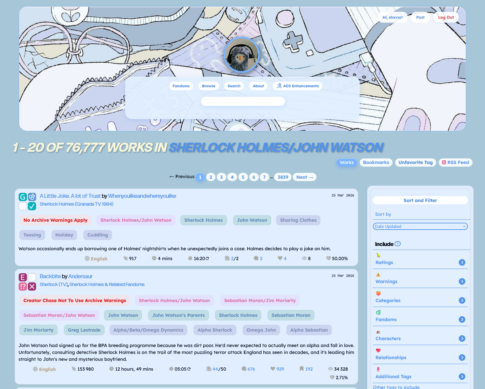
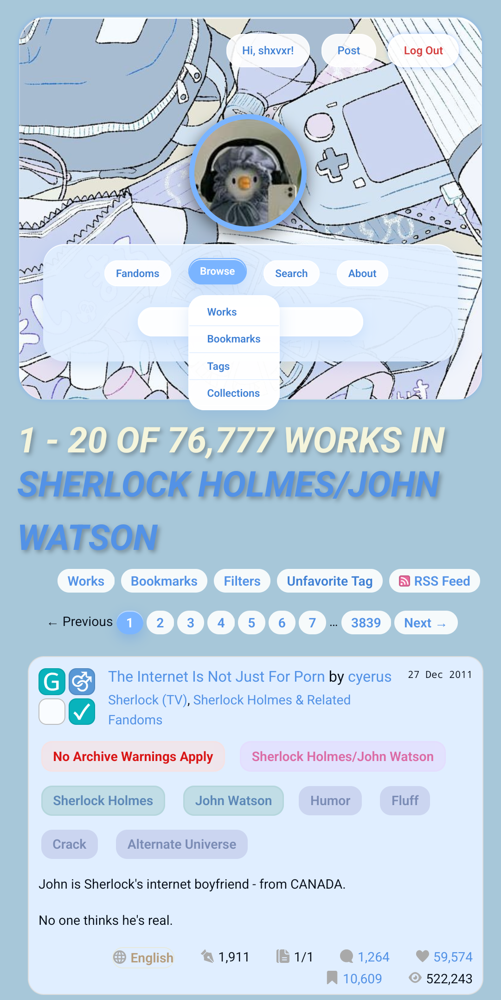
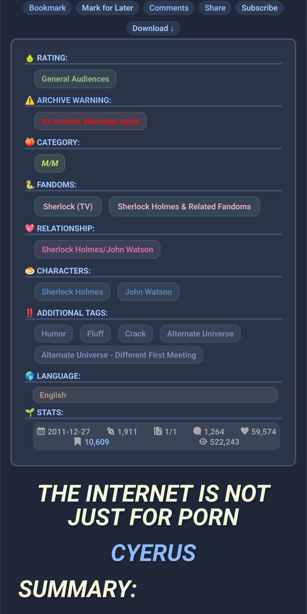
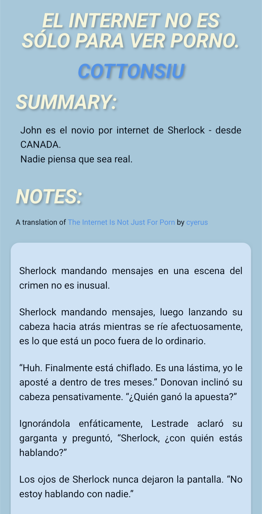
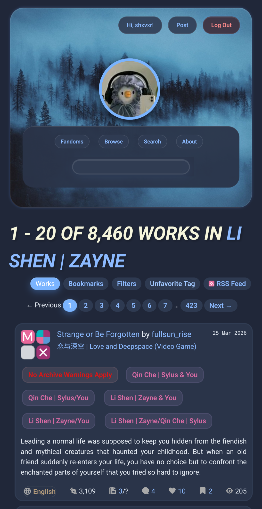
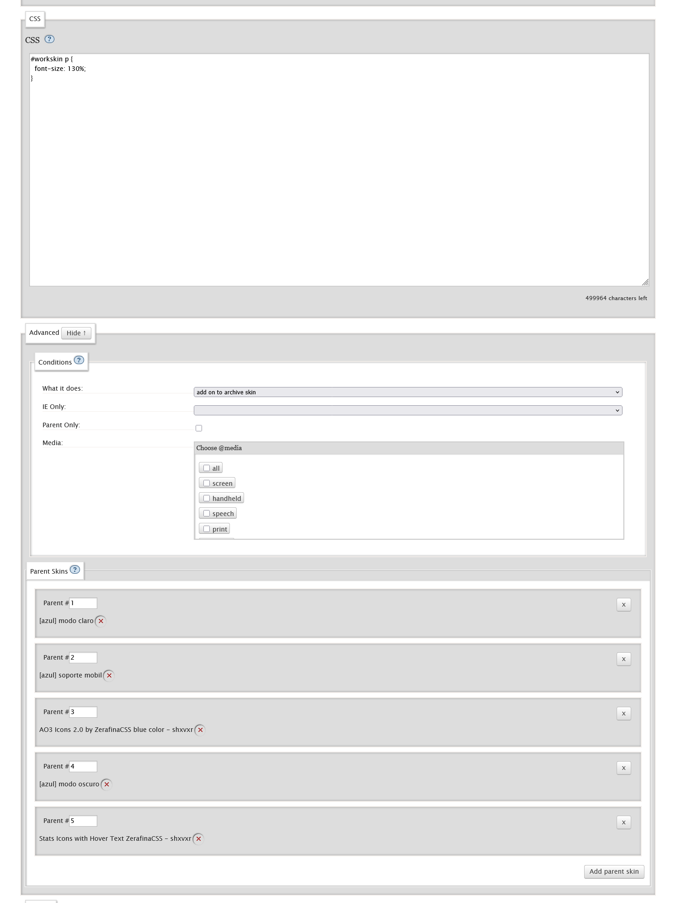

<h1 align="center">  ixtelolotli </h1>

<p align="center"> Tema para AO3 con modo claro y oscuro. </p>

<div align="center">
  


| Modo claro | Modo oscuro| 
| :---: | :---: | 
|  |  | 
|  |  | 

</div>

### Instrucciones

1. Crea una Skin llamada "ixtelolotli modo claro" + el texto que quieras. (Recuerda agregar algo más como tu usuario)
2. Copia lo que hay en light.css
3. En modo avanzado marca las opciones "parent only" y "prefers-color-scheme: light"
4. Haz los mismos pasos para el modo oscuro con el archivo night.css pero con "prefers-color-scheme: dark"
5. Crea otra skin para el modo celular, pero en opciones avanzadas selecciona "parent only" y "only screen and (max-width:42em)"
6. Por ultimo crea otra skin para la base, no es importante lo que este ahí pero recomiendo poner el tamaño de la fuente así puedes decidir que tamaño usar: 
   
```css
#workskin p {
  font-size: 100%;
}
```
  En las opciones de "parent skin" colocaremos todos los skins que creamos. Y por último recomiendo usar los [AO3 Icons 2.0 por ZerafinaCSS](https://archiveofourown.org/works/57331222) y [ Stats Icons with Hover Text por ZerafinaCSS](https://archiveofourown.org/works/55604875) y listo! Solo queda usar la skin base.
<details>
  <summary>Así quedaría la skin base</summary>

   

</details>


